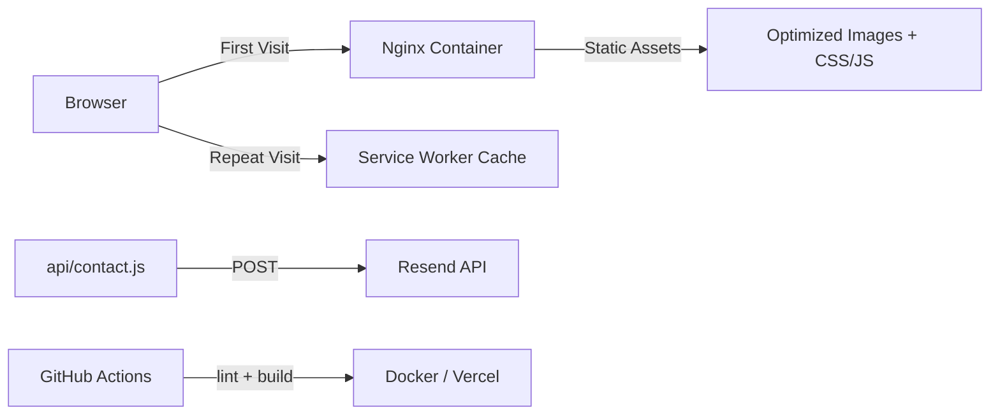

# Photography Portfolio

> Production static portfolio with optimized assets, offline caching, and containerized deployment. Built by a developer who hates slow photography sites.

## Demo

Live: **[mariopreciado.photography](https://mariopreciado.photography)**

## Why I built this

Photography portfolios should load fast and work offline. Most gallery sites are bloated with heavy frameworks and third party trackers. I wanted something that feels native, caches intelligently, and deploys anywhere. No CMS. No database. Just optimized images and a service worker that keeps things snappy.

## Features

- **Image optimization pipeline** — sharp based resizing and WebP conversion
- **Offline caching** — service worker for repeat visits
- **Containerized deployment** — Docker multi stage build
- **Contact form** — Vercel serverless endpoint with Resend delivery
- **Security first** — CSP headers, no third party scripts

## Architecture



## Quickstart

```bash
git clone https://github.com/michaelpreciado/photography-portfolio.git
cd photography-portfolio
npm ci
npm run build
npm run serve
# Open http://localhost:8000
```

## Tech Stack


## Project Structure

```
├── css/
│   ├── style.css          # Source stylesheet
│   └── style.min.css      # Minified output
├── js/
│   ├── script.js          # Main runtime
│   └── script.min.js      # Minified output
├── images/
│   └── optimized/         # Generated image manifest
├── scripts/
│   └── optimize-images.js # sharp based optimization
├── sw.js                  # Service worker
├── Dockerfile             # Multi stage production image
├── docker-compose.yml     # Local execution
└── api/contact.js         # Vercel serverless endpoint
```

## Roadmap

- [ ] Lighthouse score optimization (target 95+)
- [ ] WebP fallback for older browsers
- [ ] Image lazy loading with IntersectionObserver
- [ ] Dark mode toggle
- [ ] CDN integration for global assets

## Environment Variables

Copy `.env.example` and configure:

| Variable | Description |
|----------|-------------|
| `NODE_ENV` | `development` or `production` |
| `PORT` | Local port for serving |
| `SITE_URL` | Canonical public URL |
| `RESEND_API_KEY` | Resend API key for contact form |
| `CONTACT_TO_EMAIL` | Destination inbox |

## CI/CD

GitHub Actions runs on every PR:
1. `npm ci`
2. `npm run lint`
3. `npm run build`

## Security

- No API keys committed
- CSP defined per page
- Service worker caches same origin GET only
- Third party scripts removed from `portfolio.html`

## License

MIT License

---

**Built by Michael Preciado** — [Preciado Tech](https://preciado.tech) · [X @preciadotech](https://x.com/preciadotech)
